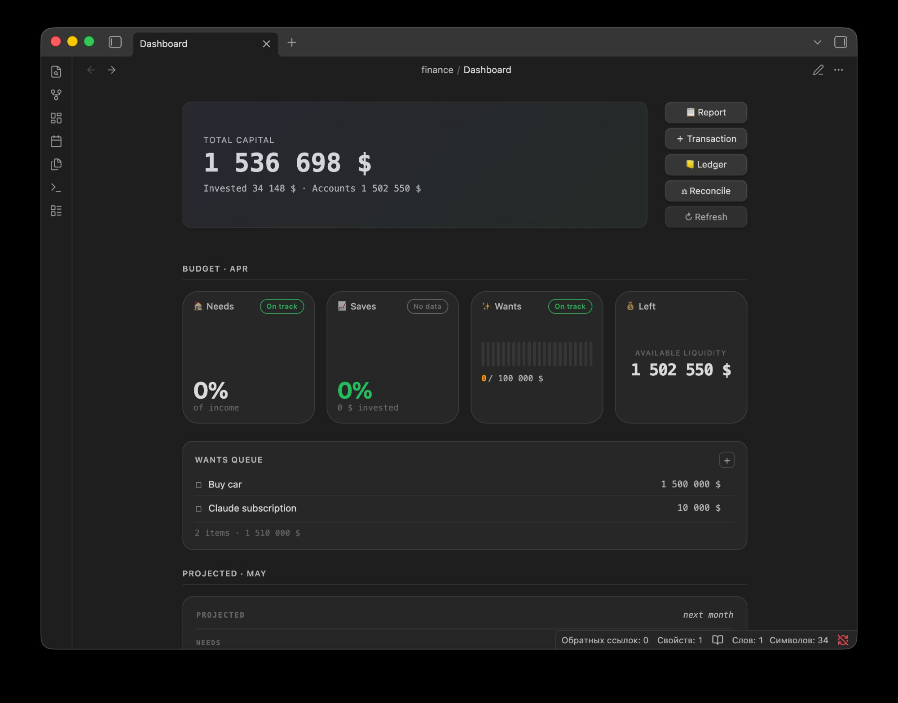
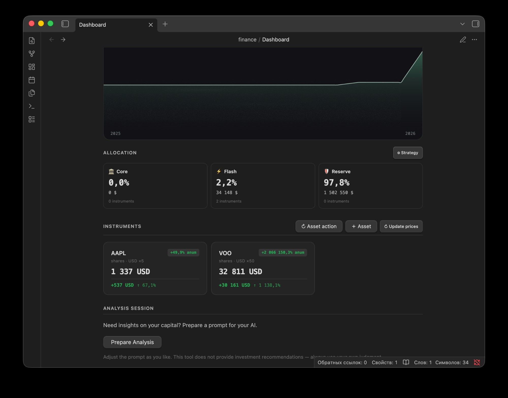

<div align="center">

# Personal Capital

**Personal finance for Obsidian.**
Cashflow, assets, dividends, deposits, FX, all in plain text inside your vault.


</div>

---

<div align="center">



</div>

## Why

The easy way to finally start tracking your expenses and budget, and even more: grow your investments.
(!) Local-first, you never loose or share your data to unknown receipents.

**Personal Capital** keeps everything in your Obsidian vault as plain text:

- A JSONL ledger is the single source of truth with one file per year, version-control-friendly.
- The dashboard is rendered live from the ledger. No hidden state, no migrations, no lock-in.
- Track your investments with fetch parser and auto update.
- This app is not an accountant tool for buisness, strategy-first, forgiving mistakes, reconcile when needed.
- Migrate to / from beancount ledger (in development)

---

## Install

### Recommended: BRAT

1. Install [**BRAT**](https://github.com/TfTHacker/obsidian42-brat) from Community plugins.
2. Open BRAT settings → **Add Beta plugin** → paste this repo URL.
3. Settings → Community plugins → enable **Personal Capital**.

BRAT will auto-update the plugin whenever a new release is published.

### Manual

1. Download `main.js`, `manifest.json`, `styles.css` from the latest [Release](../../releases).
2. Place them in `.obsidian/plugins/personal-capital/` inside your vault.
3. Settings → Community plugins → enable **Personal Capital**.

A `finance/` folder is scaffolded on first activation with an empty dashboard ready for onboarding.

---

## How to use

<div align="center">



</div>

The basic loop is simple. Log money movements as they happen, let the dashboard derive everything else, reconcile when reality drifts from the ledger.

```
┌─────────────┐    ┌──────────────┐    ┌────────────────┐    ┌─────────────┐
│  Log entry  │ ─► │  Auto-fetch  │ ─► │ Dashboard view │ ─► │  Reconcile  │
│ (income,    │    │ prices, FX,  │    │ (net worth,    │    │ (vs real    │
│  expense,   │    │  dividends   │    │  P&L, budget)  │    │  accounts)  │
│  buy/sell)  │    │              │    │                │    │             │
└─────────────┘    └──────────────┘    └────────────────┘    └─────────────┘
```

<details>
<summary><b>1. Set up accounts</b></summary>

Open the Accounts modal and add the cash containers you actually use: bank cards, broker cash, paper wallet, savings pots. Each account has a name, currency and starting balance. Everything else is derived from ledger entries that touch the account, so you do not need to keep balances in sync by hand.

Tip: keep accounts coarse. One account per real-world holder is usually enough. Splitting "groceries card" vs "groceries cash" rarely pays off.

</details>

<details>
<summary><b>2. Log income and expenses</b></summary>

Click an empty cell in the cashflow table and pick the category, or use the quick-entry modal. Each line is appended to the JSONL ledger for the year. The dashboard recalculates monthly totals on the fly.

Categories are split into baskets (needs / wants / savings) so you can see month-over-month allocation without setting hard budget caps. Hard caps are optional, leave them blank to just track.

</details>

<details>
<summary><b>3. Track investments</b></summary>

Add an asset (share, bond, deposit, cash position) with its ticker, currency and source account. Buy and sell entries flow through the ledger like any other money movement, so the cash account balance updates automatically.

The fetcher pulls prices from MOEX or Yahoo Finance and writes dividends straight into the ledger when configured. Deposit interest accrues from the rate you set, no manual coupon entries needed unless you want them.

</details>

<details>
<summary><b>4. Reconcile when reality drifts</b></summary>

Once a month, open the Reconcile modal. It diffs the real balance of each account (which you type in) against what the ledger says. The gap becomes a single adjusting entry rather than hours of detective work.

This is the forgiving part. You will miss entries. The point is to fix them in seconds, not to maintain perfect bookkeeping.

</details>

<details>
<summary><b>5. Read the dashboard</b></summary>

The top cards show total capital, monthly cashflow and budget basket allocation. The chart tracks capital growth over time. Below that you get asset allocation by class, the full instrument list with P&L, and account balances.

Everything is live. No manual refresh. Edit a ledger line and the dashboard updates next render.

</details>

<details>
<summary><b>Extras</b></summary>

- **Multi-currency.** Each account and asset carries its own currency. FX rates are fetched from CBR and applied at render time so the totals stay in your base currency.
- **Plain text.** The whole vault is your data. Back it up, sync it, version-control it, grep it.
- **Beancount bridge** (in development). Import or export to beancount-format ledgers for users who already live in that ecosystem.

</details>

---

## Privacy & network

Everything runs locally. Outbound requests are limited to public, read-only market-data endpoints:

| Endpoint | Purpose |
|---|---|
| `iss.moex.com` | Share/bond prices and dividend history |
| `query1.finance.yahoo.com` | Fallback for non-Russian tickers |
| `cbr.ru` | FX rates against RUB |

No telemetry. No analytics. No accounts. Verify by grepping `main.js` for `fetch(`.

---

## Compatibility

Obsidian **1.0.0+**, desktop and mobile.

## License

[MIT](LICENSE), © 2026
